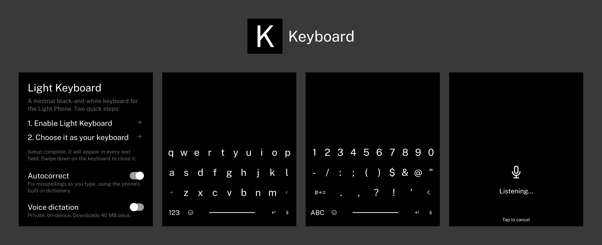

A clone of the Light Phone 3's built-in keyboard, for any app.

On a stock Light Phone, the black-and-white keyboard lives inside Light's own tools. Other apps use the
system keyboard, and there is no Light one to choose. This is a faithful recreation, packaged as a
system keyboard you can set as the default, so every app on a modified Light Phone shares the same look.

Optional autocorrect and optional voice dictation, both fully on-device and private. Swipe down on the
keyboard to hide it.

## Install

### With [Obtainium](https://github.com/ImranR98/Obtainium), which keeps you up to date

1. Install Obtainium.
2. Add an app, and give it this repository:
   `https://github.com/adam-weber/light-keyboard`
3. It installs the latest release, and tells you when there is a new one.

### Or by hand

Download the latest APK from [Releases](../../releases) and open it.

## Turn it on

Open Light Keyboard. The setup screen holds everything:

1. **Enable Light Keyboard**: opens Android's keyboard settings, where you switch it on.
2. **Choose it as your keyboard**: makes it the active one.

A few optional settings sit below:

- **Autocorrect** (on by default): fixes misspellings as you type, using your phone's built-in
  dictionary. Turn it off to type exactly what you tap.
- **Auto-Capitalize** (on by default): capitalizes the start of each sentence.
- **Auto-Period** (on by default): double-tap the space bar to insert a period.
- **Return key** / **Emoji keyboard** (both on by default): show or hide those keys.
- **Voice dictation** (off by default): turning it on downloads a ~40 MB offline speech-to-text model
  (Vosk) once, then a mic key lets you speak instead of type, entirely on-device. Once downloaded, a
  **Delete model** link appears beside the toggle to reclaim the space.
- **Keyboard layout**: choose QWERTY, AZERTY, or QWERTZ.

Layout / appearance changes take effect the next time the keyboard opens. That is the whole setup.

## Build it yourself

```sh
./gradlew :app:assembleDebug      # debug build
./gradlew :app:assembleRelease    # release build (unsigned unless signing env vars are set)
```

Needs JDK 17 and the Android SDK (API 35). Tagged releases (`v*`) are built and signed by
[`.github/workflows/release.yml`](.github/workflows/release.yml). The typing model in
`app/src/main/res/raw/charmodel.bin` is regenerated by [`tools/gen_charmodel.py`](tools/gen_charmodel.py).

## A note

This is an independent, open-source project. It is made for the Light Phone, but it is not made by Light.

## License

[MIT](LICENSE). Do what you like with it.
